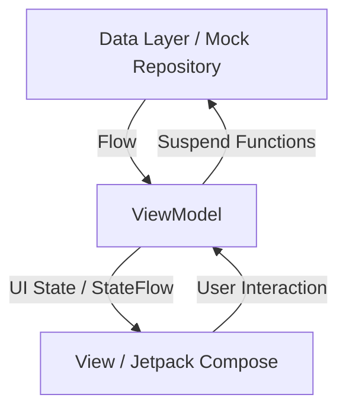

# 🚀 Nova: Cosmic Explorer 🌌

  
  
  
  

---

## 🌠 Project Overview
**Nova: Cosmic Explorer** is a high-end Android application developed as a personal educational journey to master **Kotlin** and **Modern Android Development (MAD)**. This project transforms complex astronomical data into an immersive, visually stunning mobile experience. It serves as a showcase of clean code, reactive UI, and robust architecture.

### 🎯 Learning Goals
- [x] Master **Jetpack Compose** for complex animations and custom layouts.
- [x] Implement a scalable **MVVM (Model-View-ViewModel)** architecture.
- [x] Integrate **Hilt** for industry-standard Dependency Injection.
- [x] Optimize asynchronous data handling using **Kotlin Coroutines and Flow**.
- [x] Create a premium UX with **Parallax effects** and **Glassmorphism**.

---

## 🎨 Visual Journey (Placeholders)
//TODO

---

## 🏗️ Technical Architecture
The project strictly follows the **Google Recommended Architecture** to ensure separation of concerns and testability.

### 🗺️ Data Flow Chart

### 🧱 Architectural Breakdown
- **View (UI Layer):** Built entirely with **Jetpack Compose**. Uses `StateFlow` to observe data and re-compose the UI reactively.
- **ViewModel:** Acts as the state holder. It survives configuration changes and provides a clean interface for the View to interact with data.
- **Repository:** Abstracted data source. Currently provides a Mock Implementation, but designed to easily switch to Room or Retrofit.
- **Model:** Pure Kotlin Data Classes representing the business entities (Planets, Stats).

---

## 🛠️ Modern Android Tech Stack
| Category | Technology | Description |
| :--- | :--- | :--- |
| **Language** | **Kotlin** | 100% Kotlin with modern features (Coroutines, Flow). |
| **UI** | **Jetpack Compose** | Declarative UI framework for faster development. |
| **DI** | **Hilt** | Built on top of Dagger for standard Dependency Injection. |
| **Image Loading** | **Coil** | Kotlin-first, fast, and lightweight image loader. |
| **Navigation** | **Navigation Compose** | Type-safe navigation between Composables. |
| **Lifecycle** | **ViewModel / Flow** | Lifecycle-aware components for state management. |

---

## 📊 MAD Score (Modern Android Development)
This project is built using 100% Modern Android Development tools and practices.

| Component | Usage | Rating |
| :--- | :--- | :--- |
| **Kotlin** | Full Project | ⭐⭐⭐⭐⭐ |
| **Compose** | Full UI | ⭐⭐⭐⭐⭐ |
| **Hilt** | Standard Injection | ⭐⭐⭐⭐⭐ |
| **Architecture** | MVVM | ⭐⭐⭐⭐⭐ |
| **Coroutines** | Background Tasks | ⭐⭐⭐⭐⭐ |

---

## ✨ Visual Polish & Animations
- **Parallax Backgrounds:** The galaxy shifts subtly as you navigate, creating depth.
- **Hero Transitions:** Smooth scaling and alpha transitions when scrolling through the planetary pager.
- **Glassmorphism:** Semi-transparent cards with specialized gradients to mimic frosted glass in space.
- **Adaptive Colors:** UI elements (like buttons) dynamically pull color accents from the planetary data.

---

## 🚀 How to Run
1. Clone the repository: `git clone https://github.com/yourusername/nova-cosmic-explorer.git`
2. Open in **Android Studio (Ladybug or later)**.
3. Perform a **Gradle Sync**.
4. Run on a physical device or emulator (API 24+).

---

  Developed with ❤️ by [Your Name]

